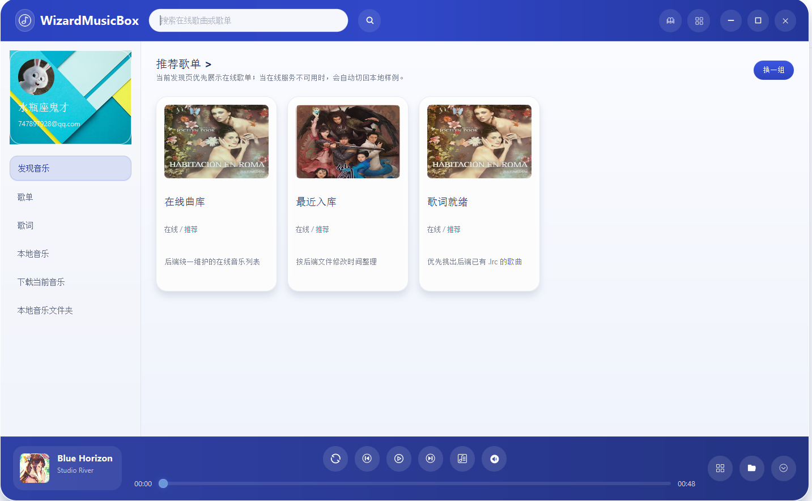
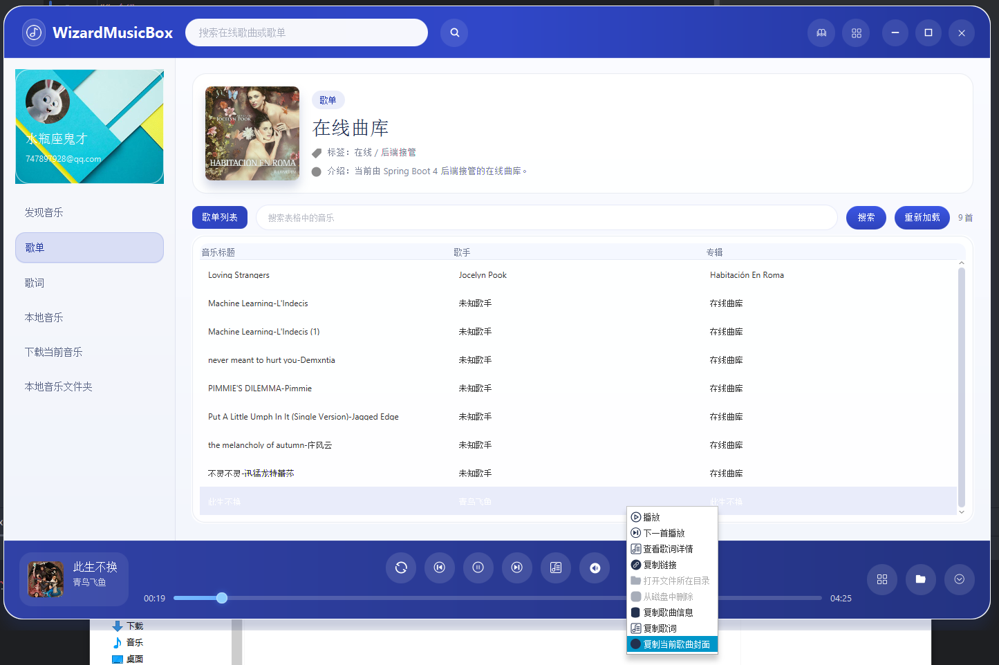
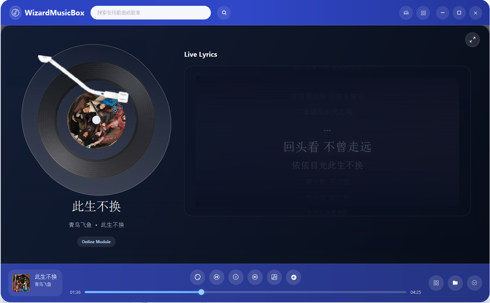
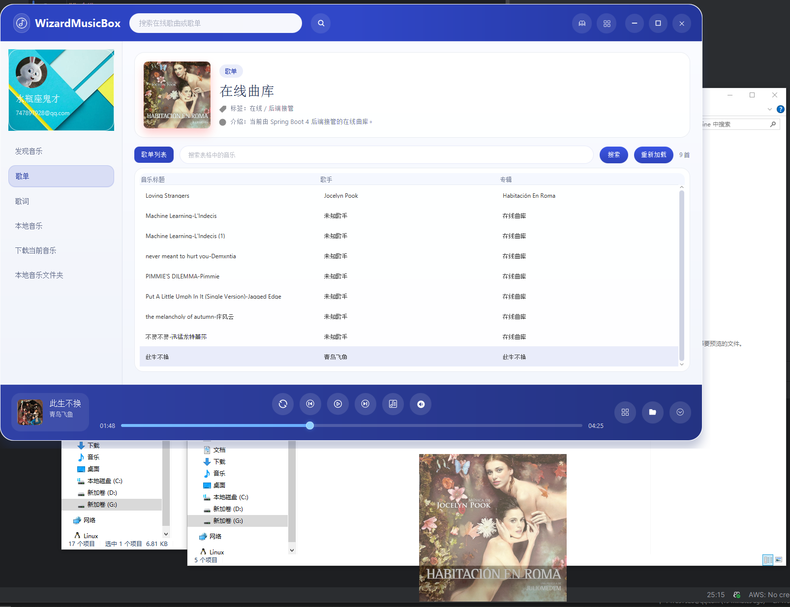
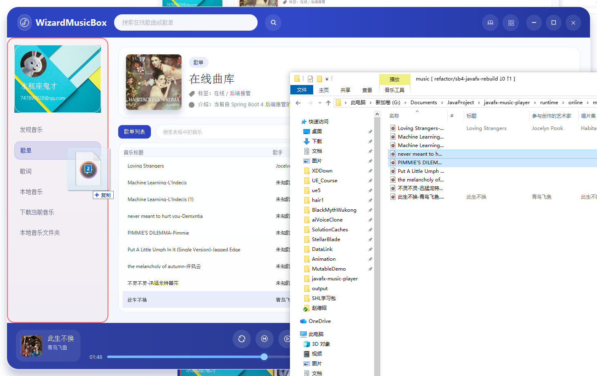
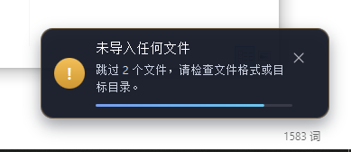
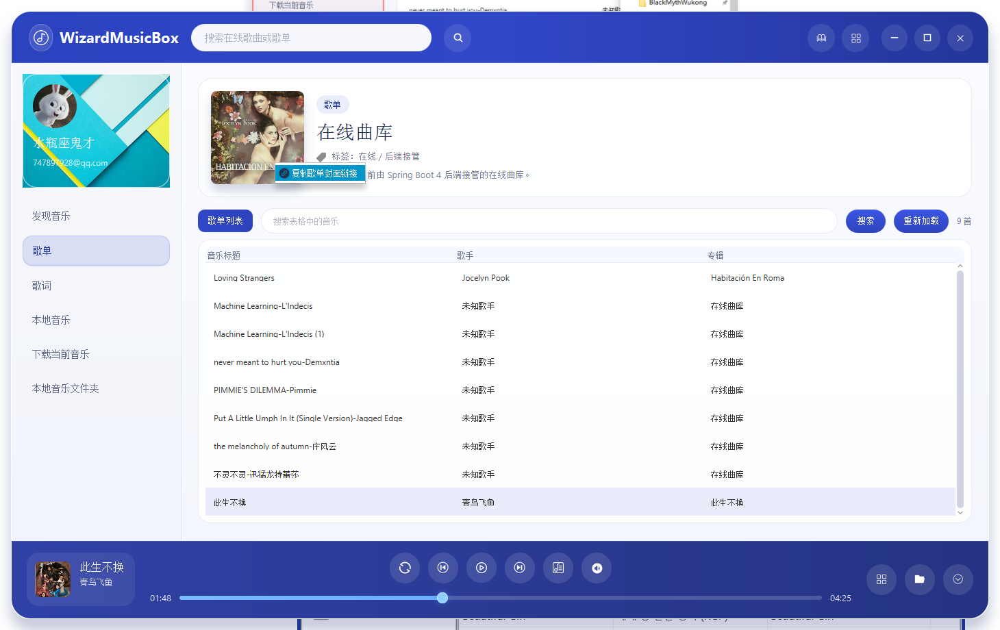
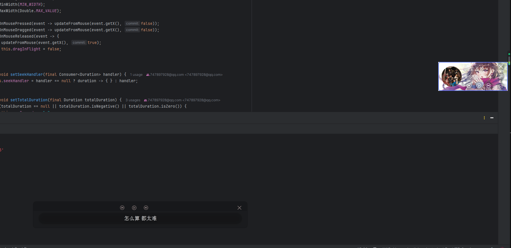
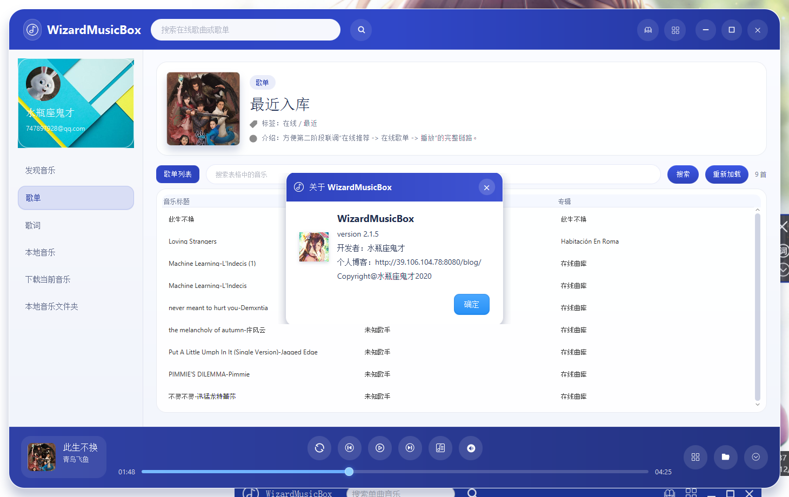

<p align="center">
  <strong>JavaFX 音乐播放器（Wizard Music Box）</strong>
</p>
<p align="center">
  <a target="_blank" href="https://github.com/747897928/Javafx-Music-Player">
    </img>
  </a>
  <a target="_blank" href="https://github.com/747897928/Javafx-Music-Player">
    </img>
    </img>
    </img>
    </img>
    </img>
    </img>
    </img>
  </a>
</p>

<p align="center">
  <a href="./README_EN.md">English README</a>
</p>

## 1. 项目简介

Wizard Music Box 是一个面向桌面场景的音乐播放器项目，代码仓库同时包含 JavaFX 客户端和 Spring Boot 后端。

这个项目当前有两条能力线：

1. 本地音乐播放  
   客户端负责扫描本地目录、读取音频标签、加载歌词、播放音频，并提供迷你模式、桌面歌词、系统托盘等桌面交互。

2. 在线曲库管理  
   后端负责维护一套由本地文件驱动的在线曲库，处理导入、扫描、元数据同步、搜索、歌词读取、音频流输出等工作。客户端通过 HTTP 接口读取这部分数据。

如果你只想使用播放器，这份文档会告诉你怎么启动、怎么配置、怎么打包。  
如果你准备继续开发，这份文档也会交代模块划分、目录约定、运行方式和后端接口入口。

## 2. 界面预览

### 2.1 发现音乐

发现音乐区域的数据来自后端，可通过界面右侧按钮刷新内容。



### 2.2 歌单与本地音乐

歌单表格可以展示发现音乐结果、本地音乐和搜索结果。本地音乐默认从 `LocalMusic/Music` 读取，歌词默认从 `LocalMusic/Lrc` 读取。



### 2.3 桌面歌词与迷你模式

歌词支持同步显示，也可以独立显示在桌面歌词窗口中。迷你模式下依旧可以完成常用播放操作。



### 2.4 封面拖拽与文件导入

封面可以直接拖出到系统中保存，音频和歌词文件也可以拖入指定区域完成批量导入。









### 2.5 其他界面





## 3. 技术栈

项目当前使用的主要技术如下：

1. Java 17  
   根 `pom.xml` 中统一声明 `java.version=17`，当前构建与运行都以 JDK 17 为基准。

2. JavaFX 17.0.1  
   桌面端位于 `player-fx`，使用 `javafx-controls`、`javafx-media`、`javafx-fxml`、`javafx-swing`。

3. Spring Boot 4.0.5  
   后端位于 `player-server`，主要使用 Web MVC、Validation、Actuator。

4. MyBatis Plus 3.5.15  
   用于后端数据访问与表记录同步。

5. SQLite 3.51.1.0  
   这是默认数据库，开箱即可运行。运行时也保留了 MySQL 和 PostgreSQL 驱动，便于后续切换。

6. Jaudiotagger 2.0.3  
   用于读取本地音频标签、时长、封面等元数据。

7. Maven 3.9+  
   整个仓库采用多模块 Maven 结构。

## 4. 核心功能

### 4.1 本地音乐能力

1. 扫描本地音乐目录
2. 读取 `.mp3`、`.wav` 等音频文件的基础元数据
3. 加载 `.lrc` 歌词文件
4. 读取音频内嵌封面
5. 支持拖拽导入音频和歌词文件
6. 支持下载在线歌曲到本地目录

### 4.2 桌面端交互能力

1. 主播放器界面
2. 迷你模式
3. 桌面歌词
4. 系统托盘
5. 封面拖拽导出
6. 右键菜单操作

### 4.3 后端在线曲库能力

1. 导入在线曲库文件
2. 扫描 `runtime/online` 下的音频、歌词和封面资源
3. 将扫描结果同步到 SQLite
4. 提供歌单、歌曲、搜索、歌词、播放地址接口
5. 提供音频流和封面访问接口
6. 提供一组兼容旧客户端调用方式的兼容接口

## 5. 模块结构

仓库采用多模块结构，根模块负责编译参数、公共版本和插件管理，业务代码拆分为四个子模块。

### 5.1 `player-common`

公共基础模块，当前主要放这类内容：

1. 通用响应对象 `ApiResponse`
2. 路径解析工具 `WorkspacePathResolver`
3. Jackson 工具类 `JacksonUtils`

### 5.2 `player-model`

共享模型模块，供桌面端和后端共用。当前包含：

1. `SongSummary`
2. `PlaylistSummary`
3. `LyricLine`

### 5.3 `player-server`

后端服务模块，负责在线曲库与媒体访问。核心组成如下：

1. `controller`
   对外提供 HTTP 接口

2. `service`
   处理在线曲库查询、同步、导入

3. `repository` 和 `mapper`
   负责数据库访问

4. `support/storage`
   负责在线曲库目录布局、文件存储、目录解析

5. `support/metadata`
   负责音频元数据读取

6. `config`
   放置存储配置和 MyBatis Plus 配置

### 5.4 `player-fx`

桌面客户端模块，负责 UI、播放和后端通信。核心组成如下：

1. `playback`
   音频播放控制

2. `local`
   本地音乐扫描与元数据读取

3. `remote`
   后端地址解析与接口调用

4. `ui`
   主界面、迷你模式、桌面歌词、提示组件、抽屉视图等桌面 UI

## 6. 运行环境

### 6.1 基本要求

1. JDK 17 或更高版本
2. Maven 3.9 或更高版本
3. Windows、Linux、macOS 任一可运行 JavaFX 的桌面环境

### 6.2 打包附加要求

如果需要打包桌面客户端，还需要：

1. 当前 JDK 自带 `jpackage`
2. 系统允许执行对应平台的打包命令

### 6.3 默认端口

后端默认监听：

```text
18080
```

## 7. 快速启动

### 7.1 启动后端

在仓库根目录执行：

```bash
mvn -pl player-server spring-boot:run
```

启动后可访问：

```text
http://127.0.0.1:18080/api/system/summary
```

### 7.2 启动桌面端

新开一个终端，在仓库根目录执行：

```bash
mvn -pl player-fx javafx:run
```

### 7.3 本地联调顺序

建议按下面的顺序启动：

1. 先启动 `player-server`
2. 确认 `http://127.0.0.1:18080/api/system/summary` 可访问
3. 再启动 `player-fx`

## 8. 配置说明

### 8.1 后端配置

后端默认配置文件位于：

```text
player-server/src/main/resources/application.yml
```

当前默认配置的关键项如下：

1. 应用名  
   `spring.application.name=wizard-music-server`

2. 数据库连接  
   默认使用 SQLite，URL 指向 `runtime/musicbox.db`

3. 端口  
   `server.port=18080`

4. 日志文件  
   `./logs/player-server.log`

5. 在线曲库目录  
   `runtime/online/music`  
   `runtime/online/lyrics`  
   `runtime/online/covers`  
   `runtime/online/cache`

### 8.2 桌面端配置

桌面端运行时配置文件位于：

```text
config/player-fx.ini
```

当前示例内容如下：

```ini
server.base-url=http://127.0.0.1:18080
```

如果桌面端需要连接别的后端实例，修改这个地址即可。

## 9. 目录结构与数据文件

### 9.1 运行期常用目录

1. 本地音乐目录

```text
./LocalMusic/Music
```

2. 本地歌词目录

```text
./LocalMusic/Lrc
```

3. 后端在线音频目录

```text
./runtime/online/music
```

4. 后端在线歌词目录

```text
./runtime/online/lyrics
```

5. 后端在线封面目录

```text
./runtime/online/covers
```

6. 后端缓存目录

```text
./runtime/online/cache
```

7. SQLite 数据库文件

```text
./runtime/musicbox.db
```

8. 日志目录

```text
./logs
```

### 9.2 数据表说明

后端初始化脚本位于：

```text
player-server/src/main/resources/schema.sql
```

当前核心表为 `online_track`，保存在线曲库歌曲的基础信息，包括：

1. 歌曲 ID
2. 文件名与文件主名
3. 音频与歌词相对路径
4. 标题、歌手、专辑
5. 时长
6. 是否有封面
7. 文件修改时间
8. 同步时间

## 10. 打包与部署

项目提供了服务端和客户端各自的打包脚本。

### 10.1 打包后端

PowerShell：

```powershell
./scripts/package-server.ps1
```

Shell：

```bash
./scripts/package-server.sh
```

默认输出目录：

```text
./dist/server/WizardMusicServer
```

压缩包输出：

```text
./dist/server/WizardMusicServer.zip
```

后端打包结果中会包含：

1. `wizard-music-server.jar`
2. `config/application.yml`
3. `bin/start-server.ps1`
4. `bin/start-server.sh`
5. `logs`
6. `runtime/online/*`

### 10.2 打包桌面端

PowerShell：

```powershell
./scripts/package-client.ps1
```

如果要在打包时写入指定后端地址，可以这样执行：

```powershell
./scripts/package-client.ps1 -ServerBaseUrl "http://your-server-host:18080"
```

Shell：

```bash
./scripts/package-client.sh
```

默认输出目录：

```text
./dist/client/WizardMusicBox
```

压缩包输出：

```text
./dist/client/WizardMusicBox.zip
```

桌面端打包脚本会通过 `jpackage` 生成可分发目录，并自动写入：

```text
config/player-fx.ini
```

## 11. 后端接口概览

这部分只列主入口，便于开发和联调时快速定位。

### 11.1 系统接口

1. `GET /api/system/summary`  
   返回应用名、工作目录、存储目录、数据库文件路径、启动时间。

### 11.2 在线曲库管理接口

1. `GET /api/online/library/tracks`  
   返回当前在线曲库歌曲列表。

2. `POST /api/online/library/refresh`  
   重新扫描在线曲库目录，并同步数据库。

3. `POST /api/online/library/import`  
   通过表单文件上传的方式导入音频或歌词文件。

### 11.3 媒体访问接口

1. `GET /api/files/audio/{songId}`  
   返回歌曲音频流，供桌面端直接播放。

2. `GET /api/files/covers/song/{songId}`  
   返回歌曲封面二进制内容。

### 11.4 兼容接口

兼容接口位于：

```text
/api/compat/netease
```

当前已实现的入口包括：

1. `GET /personalized`
2. `GET /playlist/detail`
3. `GET /search/get/web`
4. `GET /song/lyric`
5. `GET /song/enhance/player/url`

这组接口的作用，是让桌面端继续沿用一部分旧的调用习惯，同时由当前 Spring Boot 后端提供真实数据。

## 12. 使用说明

### 12.1 本地音乐

1. 将音频文件放到 `LocalMusic/Music`
2. 将歌词文件放到 `LocalMusic/Lrc`
3. 在客户端中进入本地音乐区域
4. 重新加载后即可看到本地曲目

### 12.2 在线曲库

1. 后端会从 `runtime/online` 目录读取音频、歌词和封面资源
2. 通过刷新接口或界面动作触发同步
3. 客户端通过后端接口读取歌单、歌曲、歌词和播放地址

### 12.3 下载与拖拽

1. 在线歌曲可以下载到本地目录
2. 歌单封面支持拖拽导出
3. 音频和 `.lrc` 文件支持拖拽导入

## 13. 常见问题

### 13.1 后端能启动，客户端连不上

建议按下面的顺序检查：

1. 确认后端已启动
2. 确认 `config/player-fx.ini` 中的 `server.base-url` 地址可访问
3. 确认端口 `18080` 没有被别的服务占用
4. 直接访问 `http://127.0.0.1:18080/api/system/summary` 看是否有响应

### 13.2 桌面端打包失败

优先检查：

1. 当前 JDK 是否包含 `jpackage`
2. `JAVA_HOME` 是否指向正确版本
3. 是否先完成了 Maven 构建

### 13.3 本地歌曲或歌词没有显示

优先检查：

1. 文件是否放在默认目录
2. 文件扩展名是否正确
3. 目录中是否存在无法读取的文件

### 13.4 在线曲库内容没有刷新

优先检查：

1. `runtime/online` 下是否已有文件
2. 是否执行了刷新动作或刷新接口
3. 后端日志中是否有导入或扫描异常

## 14. 开发说明

### 14.1 推荐开发流程

1. 在根目录执行 Maven 命令
2. 先启动后端，再启动桌面端
3. 修改后端接口时，优先确认桌面端对应调用点
4. 修改桌面端远程逻辑时，优先检查 `player-fx/remote`

### 14.2 联调关注点

1. 后端在线曲库接口与兼容接口都在用
2. 媒体流接口直接影响桌面端播放
3. 目录约定对扫描、导入、播放、下载都有影响

### 14.3 后续扩展建议

如果后续继续演进这个项目，优先级较高的方向一般包括：

1. 补充更完整的接口文档
2. 增加自动化测试
3. 抽离更清晰的播放状态管理
4. 增加数据库切换说明和迁移脚本
5. 完善客户端配置项说明
